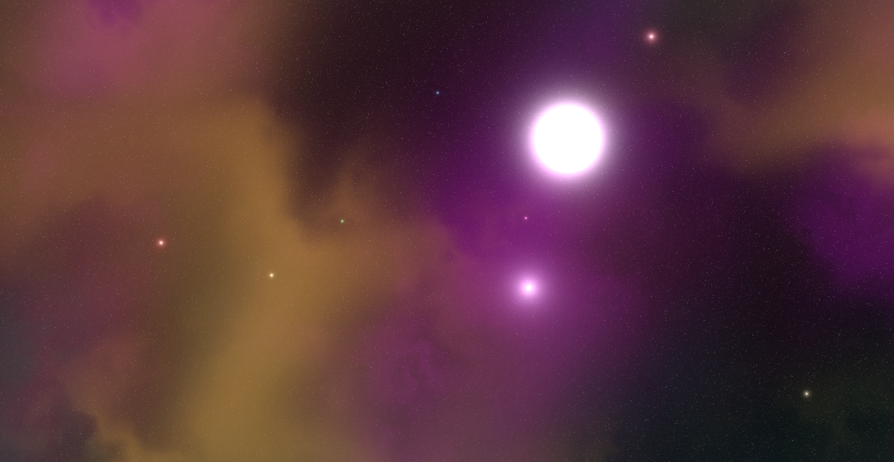

   

[Live version](https://vangelov.github.io/space-2d/)

---

This is a WebGL 2 reimplementation using [PicoGL](https://tsherif.github.io/picogl.js/) of the beautiful 2D space rendering from [Rye Terrell’s article](https://wwwtyro.net/2016/10/22/2d-space-scene-procgen.html). I’ve simplified it a bit by omitting custom configuration support. There’s also no build process, and no third-party dependencies apart from PicoGL.
